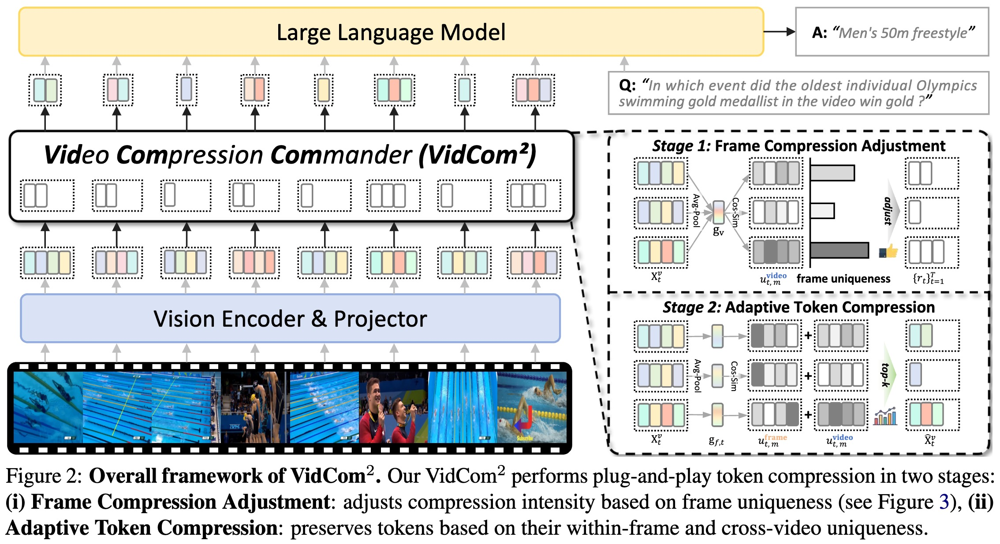
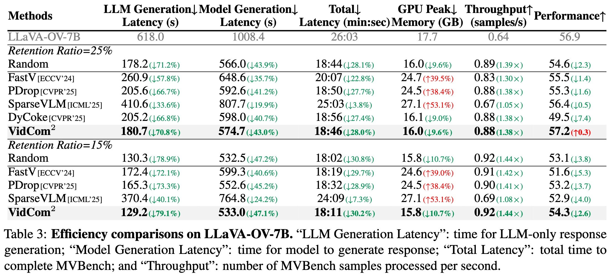

<div align=center>

<h1> 📹 Video Compression Commander: Plug-and-Play Inference Acceleration for Video Large Language Models 🚀 </h1>


<h4 align="center"> 

[Xuyang Liu](https://xuyang-liu16.github.io/)<sup>1,2*</sup>,
Yiyu Wang<sup>1*</sup>,
Junpeng Ma<sup>3</sup>,
[Linfeng Zhang](http://www.zhanglinfeng.tech/)<sup>1✉</sup>

<sup>1</sup>Shanghai Jiao Tong University, <sup>2</sup>Sichuan University, <sup>3</sup>Fudan University

</h4>

</div>

## 🔥 News

* **`2025.05.21`** 🤗🤗 We release our latest work [VidCom<sup>2</sup>](https://arxiv.org/abs/2505.14454), a plug-and-play inference acceleration method of **VideoLLMs**. [Code](https://github.com/xuyang-liu16/VidCom2) is available!

## 📌 Highlights

- **Model Adaptability:** Compatible with most VideoLLMs (e.g., LLaVA, Qwen-VL series).
- **Operator Compatibility:** Works seamlessly with efficient operators like Flash Attention 2.
- **Strong Performance:** Uses only 25% of tokens while maintaining 99.6% performance of LLaVA-OV.
- **High Efficiency:** Cuts LLaVA-OV generation time by 70.8% and overall latency by 43.0%.

## ✨ Overview

<p align="center">  </p>

> **TLDR:** We present VidCom<sup>2</sup>, a plug-and-play framework that dynamically compresses video tokens based on frame uniqueness, achieving state-of-the-art efficiency and performance across various VideoLLMs and benchmarks.


## 💥 Core Codes and Supported Models

The core implementation of our code is in [`llava/model/vidcom2.py`](https://github.com/xuyang-liu16/VidCom2/blob/main/llava/model/vidcom2.py). 

- **LLaVA-OneVision:** It is called at [`llava/model/llava_arch.py`](https://github.com/xuyang-liu16/VidCom2/blob/ebb4260650cba4177534cdb0f6a3642c306c607c/llava/model/llava_arch.py#L355).
- **LLaVA-OneVision:** It is called at [`llava/model/llava_arch.py`](https://github.com/xuyang-liu16/VidCom2/blob/ebb4260650cba4177534cdb0f6a3642c306c607c/llava/model/llava_arch.py#L324).
- **Qwen2-VL:** It is called at [`transformers/models/qwen2_vl/modeling_qwen2_vl.py`](https://github.com/xuyang-liu16/VidCom2/blob/main/transformers/models/qwen2_vl/modeling_qwen2_vl.py#L55).

## 🛠 Preparation

1. Clone this repository：
```bash
git clone https://github.com/xuyang-liu16/VidCom2.git
cd VidCom2
```

2. Environment Setup and Preparation:
```Shell
conda create -n VidCom2 python=3.10 -y
conda activate VidCom2
pip install --upgrade pip  # Enable PEP 660 support.
pip install -e ".[train]"
pip install git+https://github.com/EvolvingLMMs-Lab/lmms-eval.git
```

## 🚀 Performance Evaluation

We use the [lmms-eval](https://github.com/EvolvingLMMs-Lab/lmms-eval) toolkit to evaluate our models. 
👉 You can reproduce all of our ablation experiments by modifying the parameters of the [`vidcom2_compression`]([https://github.com/xuyang-liu16/GlobalCom2/blob/main/llava/model/vidcom2.py](https://github.com/xuyang-liu16/VidCom2/blob/98cf6b4b1688fc90b1cc268db50aff7c4a6de941/llava/model/vidcom2.py#L4))function! By default, the retention ratio is 0.25.

You can choose whether to use flash attention, but in our efficiency analysis, if flash attention can be used, then it should be used.

To evaluate LLaVA-OneVision-7B, you can use:
```
accelerate launch --num_processes=8 \
  -m lmms_eval \
  --model llava_onevision \
  --model_args pretrained=lmms-lab/llava-onevision-qwen2-7b-ov,conv_template=qwen_1_5,model_name=llava_qwen,attn_implementation=flash_attention_2 \
  --tasks videomme,mlvu_dev,longvideobench_val_v,mvbench \
  --batch_size 1 \
  --log_samples \
  --log_samples_suffix llava_onevision \
  --output_path ./logs/
```
To evaluate LLaVA-Video-7B, you can use:
```
accelerate launch --num_processes=8 \
  -m lmms_eval \
  --model llava_vid \
  --model_args pretrained=lmms-lab/LLaVA-Video-7B-Qwen2,conv_template=qwen_1_5,max_frames_num=64,mm_spatial_pool_mode=average,attn_implementation=flash_attention_2 \
  --tasks videomme,mlvu_dev,longvideobench_val_v,mvbench \
  --batch_size 1 \
  --log_samples \
  --log_samples_suffix llava_vid \
  --output_path ./logs/
```
To evaluate Qwen2-VL, you can use:
```
accelerate launch --num_processes=8 \
  -m lmms_eval \
  --model qwen2_vl \
  --model_args=pretrained=Qwen/Qwen2-VL-7B-Instruct,attn_implementation=flash_attention_2 \
  --tasks videomme,mlvu_dev,longvideobench_val_v,mvbench \
  --batch_size 1
  --log_samples
  --log_samples_suffix reproduce
  --output_path ./logs/

```

## ⚡ Efficiency Analysis
<p align="center">  </p>

VidCom<sup>2</sup> employs  [lmms-eval](https://github.com/EvolvingLMMs-Lab/lmms-eval) for inference, and all efficiency analyses are based on [LLaVA-OneVision-7B](https://github.com/LLaVA-VL/LLaVA-NeXT.git).

The code of measuring the total time for **model generation** and **GPU peak memory** is located in [lmms_eval/models/llava_onevision.py](https://github.com/xuyang-liu16/VidCom2/blob/3be0e66d563c16e980145f925a55949ea431a2d8/lmms-eval/lmms_eval/models/llava_onevision.py#L568).

The code of measuring the total time for **LLM generation**  is located in [llava/model/language_model/llava_qwen.py](https://github.com/xuyang-liu16/VidCom2/blob/3be0e66d563c16e980145f925a55949ea431a2d8/llava/model/language_model/llava_qwen.py#L145).


## 📌 Citation

Please consider citing our paper in your publications, if our findings help your research.

```bibtex
@article{liu2025vidcom2,
  title={Video Compression Commander: Plug-and-Play Inference Acceleration for Video Large Language Models},
  author={Liu, Xuyang and Wang, Yiyu and Ma, Junpeng and Zhang, Linfeng},
  journal={arXiv preprint arXiv:2505.14454},
  year={2025}
}
```

## 👍 Acknowledgment
We extend our gratitude to the open-source efforts of [LLaVA-OneVision](https://github.com/LLaVA-VL/LLaVA-NeXT) and [Qwen2-VL](https://github.com/QwenLM/Qwen2.5-VL).


## 📩 Contact
For any question about our paper or code, please email `liuxuyang@stu.scu.edu.cn`.
